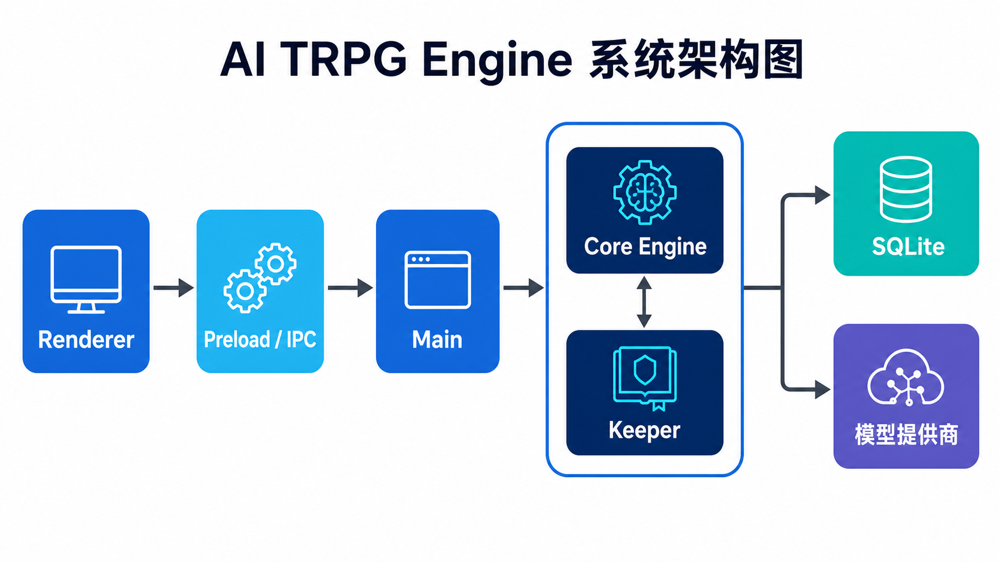

# AI TRPG Engine

一个本地优先、AI 主持、确定性规则内核的单人 TRPG 引擎：Electron 客户端负责权威游戏状态，FastAPI + LangChain 网关负责模型接入、RAG 检索和有证据约束的规则 Agent。

## 系统架构



核心边界很简单：模型可以生成叙事和选择工具，但不能直接改写事实、骰点或判定结果。战役事件仍由 Electron 内核提交到本地 SQLite；AI 网关的数据库只保存接口运行元数据。

## 核心能力

| 能力 | 当前实现 | 设计目的 |
| --- | --- | --- |
| 确定性事件内核 | 已实现 | 同一 seed/turn 可重放，模型不能覆盖已提交事实 |
| Electron Windows 客户端 | 已实现 | 本地战役、内容包、时间线与安全凭据存储 |
| FastAPI AI 网关 | 已实现 | 提供健康检查、检索、聊天和规则 Agent 接口 |
| LangChain 聊天与 RAG | 已实现 | 对接 OpenAI-compatible 模型；JSON 向量索引启动时载入内存 |
| 有证据约束的 Agent | 已实现 | LLM 只选择工具和解释，程序根据工具证据生成权威判定 |
| SQLite / PostgreSQL | 已实现 | SQLite 零配置启动；通过 `DATABASE_URL` 可切 PostgreSQL |
| LoRA 微调与三档评测 | 接口已预留，训练未完成 | 后续用 base / RAG / LoRA 同集评测，不提前宣称效果 |

## 运行 Windows / Electron 客户端

需要 Bun 1.3.x。仓库根目录执行：

```powershell
bun install --ignore-scripts
bun run desktop:check
bun run desktop
```

生成 Windows x64 解包版：

```powershell
bun run package:win
```

产物位于 `electron/release/win-unpacked/`。Electron 工作区的完整命令见 [`electron/README.md`](electron/README.md)。

## 运行 FastAPI AI 网关

需要 Python 3.11+。默认数据库为 SQLite；聊天默认按 DeepSeek 的 OpenAI-compatible 接口配置，向量化默认连接本机 Ollama `bge-m3`。请使用新生成的密钥，不要复用曾经出现在聊天、截图或提交记录中的密钥。

```powershell
cd services/ai-api
python -m venv .venv
.\.venv\Scripts\python.exe -m pip install -e ".[test]"
Copy-Item .env.example .env
# 编辑 .env，填写新生成的 UPSTREAM_API_KEY
.\.venv\Scripts\python.exe -m uvicorn app.main:app --host 127.0.0.1 --port 8000
```

打开 `http://127.0.0.1:8000/docs` 可查看自动生成的接口文档。详细的 API 示例、环境变量和数据库切换方式见 [`services/ai-api/README.md`](services/ai-api/README.md)。

## SQLite 与 PostgreSQL

- 本地演示：保持 `DATABASE_URL=sqlite:///./data/ai-api.db`，无需额外服务。
- PostgreSQL：设置 `DATABASE_URL=postgresql+psycopg://...`，业务代码不变。
- Docker Compose：`docker compose -f services/ai-api/compose.yml up --build`。

FastAPI 数据库仅保存 endpoint、模型名、状态、时延和 token 数，不保存 Prompt、生成正文或 API Key；战役事实仍以 Electron 的 `campaign.sqlite` 为准。

## 验证

```powershell
# Python 网关离线测试
cd services/ai-api
.\.venv\Scripts\python.exe -m pytest -q -rs

# Electron AI 层与 Bench 隔离回归
cd ../..
bun --cwd electron test src/core/ai/lc scripts/bench-mode.test.ts
bun run --cwd electron typecheck
```

## 当前状态与路线图

当前版本适合作为可运行的工程演示：具备桌面端、确定性内核、FastAPI、LangChain、RAG、Agent、SQLite/PostgreSQL 切换点和离线回归测试。LoRA 实际训练及 base/RAG/LoRA 新三档结果尚未完成；流式输出、异步任务队列、生产监控以及把 JSON 索引迁移到 pgvector/Milvus 都是后续扩展方向。

随包规则文本仅包含开放内容，项目与任何商业 TRPG 品牌无官方关系。
