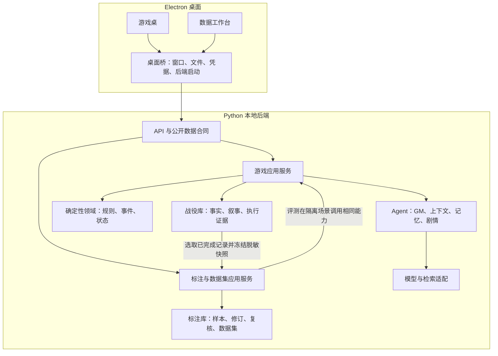
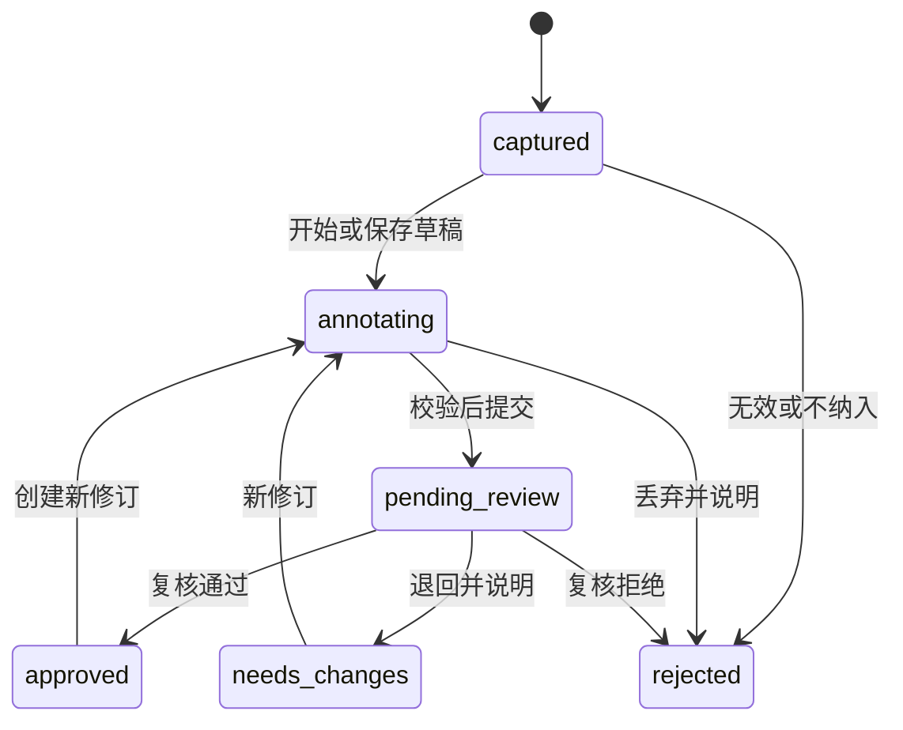

# AI TRPG Engine V1.0 架构手册

版本：设计稿 1.0 · 2026-09-29
适用范围：Python 核心、薄 Electron 桌面端、单人跑团与数据标注工作台。
状态：目标架构设计，尚未实现。本文替代此前的 Python 迁移草案及其“内容作者”交付要求。

## 1. 目标、范围与文档权威

### 1.1 最终交付

交付一个 Windows x64 本地应用，提供两个明确入口：

- **游戏桌**：玩家能够导入支持的内容，创建并完成战役，保存、恢复、回滚和分支。

- **数据工作台**：维护者能够把玩家对话、模型回复及 Agent 执行证据整理成可复核、可追溯、可导出的标注数据集，并用来评测产品改动。

Python 是唯一业务后端。Electron 保留窗口、文件选择、凭据保管与本地后端生命周期，React 负责展示和交互。

V1.0 完成条件同时包括游戏、数据标注和正式分发。只完成迁移、标注界面或合成演示，都不能称为完整 V1.0。

### 1.2 范围调整

| 范围 | V1.0 决定 |
| --- | --- |
| 玩家导入、校验、安装、选择已有内容 | 保留；这是运行游戏所需的能力 |
| 面向内容作者的制作、编辑、发布、教学与分发工作台 | 移除，不列为交付或验收条件 |
| 作者 CLI、内容创作市场、自动生成完整可发布模组 | 不建设；已有脚本可保留为内部开发工具 |
| 游戏对话与 Agent 执行数据的标注、修订、复核、数据集导出 | 纳入正式产品范围 |
| 通用外部数据导入、图像/音视频标注、多人任务分发和组织权限 | 当前设计不包含 |
| 多人联机、真人 GM 工作台、任意代码插件、所有规则和模型兼容 | 不包含 |
| 自动训练、自动上线模型或根据标注直接修改游戏事实 | 不包含；训练工具继续独立 |

标注范围是本手册的明确设计假设：本地单使用者，针对本项目产生的数据。标注人与复核人可以是同一人，但必须如实标记为自复核，不能宣称双人独立标注。

### 1.3 阅读和变更规则

1. 用户最新要求优先。

2. [产品路线图](00-product/roadmap.md)定义交付范围；本文定义目标职责、合同和验收。

3. [核心原则](00-product/principles.md)中的事实权威、信息可见性和非破坏性历史继续有效。

4. 旧 01–05 设计中的可复用规则作为参考；与 Python 归属、作者范围和数据标注设计冲突的部分被本文替代。

5. [当前状态](CURRENT-STATUS.md)描述已有证据，不得用本文的设计冒充已实现功能。

本手册是统一架构入口。后续实施计划按里程碑细化，不另建相互竞争的总体方案。

## 2. 当前基础与必须改变的边界

| 当前证据 | 新架构处理 |
| --- | --- |
| renderer/session.ts 同时包含桌面调用和浏览器本地游戏流程 | 统一调用 Python，移除正式前端中的领域执行职责 |
| main/services/turns.ts 混合规则、模型、存储、推送和审计 | 按 Python 应用用例、Agent、领域与基础设施拆分 |
| keeper、TypeScript LangChain Bench、Python gateway 并存 | 正式流程与评测统一使用 Python 的应用/Agent 能力 |
| pack.ts 混合文件读取、浏览器存储、内容校验与全局单例 | 内容按战役显式绑定；读取、校验与索引分离 |
| 现有 audit 支持“不满意”、诊断、人工修订与 audit-case-v1 导出 | 迁移现有证据采集；新增独立样本、标注修订和数据集快照 |
| dataset_candidates 依赖负面反馈，人工结果保存在候选记录上 | 样本与反馈解耦；增加优质/中性样本、版本和复核记录 |
| exported 是旧候选状态，导出只关联一个 batch 字段 | 导出成为独立不可变批次，一个样本版本可出现在多个明确版本的数据集中 |
| Python 已有确定性骰子，但属性加骰点规则不同于游戏百分骰 | 复用随机数，迁移正式游戏规则，不用网关工具替代完整内核 |

源码依据：

- [前端会话](../electron/src/renderer/session.ts)、[桌面回合服务](../electron/src/main/services/turns.ts)。

- [审计类型](../electron/src/core/audit/types.ts)、[复核服务](../electron/src/main/services/audit-service.ts)、[旧导出](../electron/src/core/audit/export.ts)。

- [审计表](../electron/sql/campaign-0008-turn-audit.sql)、[内容加载](../electron/src/core/engine/pack.ts)、[Python 网关](../services/ai-api/app/gateway.py)。

以上为代码检查所得。此前离线 architecture-check 的 22 项检查通过、状态指纹为 b6506aeb；这只作为旧确定性行为基线，不代表新架构或新标注流程通过验收。

## 3. 总体架构

采用一个 Python 应用进程中的模块化架构，不拆成多个微服务。



图中的数据库访问由存储适配器完成。数据工作台不能把人工修订写回权威战役，评测也不能在正在游玩的战役上执行。

### 3.1 目录与职责

先复用现有顶层路径，随实际功能迁移创建文件，不预建空壳：

```text
electron/src/
  main/                       窗口、后端进程、凭据与文件桥
  preload/                    最小桌面接口
  renderer/
    api/                      后端合同类型、请求与事件订阅
    game/                     游戏页面和界面状态
    annotation/               样本列表、标注、复核、数据集页面
    ui/                       共用展示组件

services/ai-api/app/
  main.py                     应用装配与生命周期
  api/                        请求校验、公开 DTO、路由、事件流
  application/
    campaigns.py              战役与角色用例
    turns.py                  回合唯一入口
    recovery.py               备份、恢复、分支
    annotations.py            采样、标注修订、提交复核
    datasets.py               冻结、校验、导出
    evaluations.py            固定数据集的隔离评测
  domain/
    game/                     规则、状态、事件、内容能力与不变量
    annotation/               标签规范、标注状态、用途资格
  agents/                     GM、上下文、记忆、剧情、工具合同与守卫
  infrastructure/             SQLite、内容文件、模型、检索、导出文件适配

tools/lora/                    独立训练工具，消费明确导出的数据集
tools/embedding/               独立训练工具
```

### 3.2 依赖规则

- api 只调用应用用例，不拼 Prompt、执行规则或直接写 SQL。

- application 组织领域逻辑和已注入的模型/存储访问，拥有提交与事务边界。

- domain 不导入 FastAPI、LangChain、Electron、React、文件系统或数据库驱动。

- agents 返回经过结构校验的候选、信息请求或叙事，不直接写权威状态。

- infrastructure 实现具体 I/O，应用装配处注入；只为实际需要替换的模型和仓储定义接口。

- renderer 只读取 DTO 和操作进度，不导入后端领域实现，不重放权威事件、不调用模型。

- 游戏与标注模块共享源标识和公开合同，不共享可被任意修改的内存对象。

- 领域模型、API DTO 和导出格式分别版本化；前端协议类型从后端合同生成，禁止多处手写等价类型。

## 4. 游戏主流程与权威状态

### 4.1 一个行动的生命周期

```text
提交 commandId + campaignId + branchId + expectedStateVersion + 玩家输入
→ 取得/创建 operation，检查重复命令
→ 加载内容绑定、角色和当前状态，校验前置条件
→ 确定性快路径或 GM 结构化理解
→ 验证候选意图和工具参数
→ 确定性规则计算
→ 事务内再次检查状态版本，提交规则结果、事件与版本
→ 根据已提交结果生成并校验叙事
→ 保存最终回复，发送公开操作结果
→ 运行带来源和版本的后台派生任务
```

查询、澄清、无效请求沿用明确的“不消耗行动”语义，不统一强制生成一次事实提交。

- 同一 commandId 在同一分支内只对应一次操作；并发重复请求返回同一 operation。

- 模型调用期间不保持数据库写事务。提交前发现版本已变化则冲突退出，不能把旧上下文的结果写进去。

- 规则随机数绑定稳定的决策身份；重试生成语言不得重新掷骰。

- 叙事失败发生在提交之后时，返回“结果已保存，叙事待恢复”，重试只继续叙事。

- 原始模型片段不直接推给玩家。V1 先采用整段守卫通过后的公开文本/分段展示；真正逐 Token 显示必须另有不泄漏的验证。

- operation 的持久化状态与结果是恢复依据，SSE 只是进度通道。断线后可重新查询，不能依赖曾收到某个前端事件。

- 崩溃后的未提交任务可重新校验并重试；已提交任务仅恢复后续步骤。

### 4.2 领域与内容

GameState 按角色、资源、物品、位置、关系和剧情进度组织，规则绑定与内容绑定显式传入。先支持现有百分骰规则及已声明的内容能力，不为“所有规则”建设任意脚本执行器。

内容绑定至少包含 contentId、version、contentHash、formatVersion 和 ruleRef。导入文件经过格式、引用、路径和能力校验；现有故事与文字卡可迁移，不能只把“解析成功”当作“能开局”。

普通文字卡只承诺角色互动；轻量内容支持已提供的状态；完整包支持其实际具备的规则与剧情。V1 不提供作者编辑或发布流程，也不自动把缺失设定补写成原始内容事实。

事件只追加。快照、上下文和记忆是派生数据；恢复与纠错通过独立分支或明确事件表达，不改写原历史。旧存档通过版本适配读入，规则结果和玩家可观察事实保持兼容。

## 5. Agent 与模型调用

| 职责 | 输入/输出边界 | 失败行为 |
| --- | --- | --- |
| GM 行动理解 | 玩家输入、公开状态 → 意图或必要澄清 | 不合法或不确定时澄清，不猜测高影响行动 |
| GM 叙事 | 已提交结果和可见上下文 → 叙事与建议 | 守卫拒绝后有限重试，再使用有来源的降级提示 |
| Context / Information | 必需上下文与检索证据 → 受约束补充 | 保留基础上下文，不因排序失败阻塞普通回合 |
| Memory | 固定范围对话与事件 → 带来源的记忆候选 | 失败不推进处理游标，不丢失原始材料 |
| Director | 已提交剧情变化和可达性 → 剧情机会候选 | 不自动确认事实，不撤销玩家已造成的后果 |
| 标注辅助诊断 | 冻结样本与证据 → 建议标签、说明 | 标为机器建议，不能代替人工复核 |

这些是逻辑职责，不要求一个职责对应一个独立模型或常驻 Agent。规则计算、事务与权限属于程序。

- 所有模型任务使用统一适配层，记录 taskType、modelId、promptVersion、schemaVersion、attempt、usage 与结果状态。

- V1 工具白名单围绕状态查询、内容检索、记忆检索和受限判定；提交入口只属于应用服务。

- 不把玩家输入、内容卡或检索文本提升为系统指令；工具参数再次由程序验证。

- 使用明确的单任务超时、尝试次数、上下文和工具调用预算，不允许无限循环。迁移时沿用现有任务预算作为起点，写入实际任务定义并做终止测试。

- 后台任务优先级低于前台回合，结果记录 basedOnStateVersion；过期结果不能覆盖新状态。

- 后台模型任务按真实需求启用，不因旧代码存在就全部自动接通。

- 评测调用同一 GM、守卫、检索和规则实现，仅替换模型/数据库等外部依赖，不维护另一套“评测专用产品逻辑”。

## 6. 数据标注工作台

### 6.1 标注单位与采集入口

基本单位是一次可解释的任务结果：玩家回合最终回复，或同一回合中的一个具体 Agent 任务。每个样本保留任务类型、输入上下文、候选输出、证据引用和来源，不把整场战役直接当作一个样本。

V1 提供三种采集入口：

1. 玩家对最终回复标记“有问题”或“值得保留”，可补说明。

2. 维护者从已完成的对话/运行记录选择样本，也可按可记录的抽样规则选取中性样本。

3. 程序检查发现合同失败、守卫拒绝或工具异常时，创建诊断候选；只保留明确可采集范围内的数据。

重复采集通过 sourceKey 去重：战役、分支、trace、任务/输出身份与目标粒度共同确定。一个回合与其中子任务可以分别成为样本，但同一目标的重复点击不能重复入池。

反馈只是样本来源之一。样本无需拥有“不满意”反馈；优质、普通、失败样本都可以进入工作台。自动采样保留抽样规则、分母、时间范围和 seed，避免只采集失败而误报整体效果。

未完成或缺证据的运行可作为诊断样本，必须标记 completeness；不能自动进入训练集。

### 6.2 样本与标注分离

| 对象 | 必须保留的字段 | 可修改性 |
| --- | --- | --- |
| Sample | sampleId、sourceKey、sourceKind、captureReason、campaign/branch/turn/trace/task 引用、contextHash、sourceHash、completeness、capturedAt | 冻结；修正来源需建立新快照并说明关系 |
| TaskSnapshot | taskType、schema/Prompt/model 版本、脱敏 inputMessages、公开状态与工具证据、候选输出、缺失字段清单 | 冻结；不可用“当前最新上下文”替代 |
| AnnotationRevision | sampleId、revision、rubricVersion、问题标签、维度评分、修订回复、偏好选择、用途建议、说明、annotatorId、时间 | 保存为新修订；已提交版本不覆盖 |
| ReviewDecision | sampleId、annotationRevision、decision、reviewerId、reviewMode、理由和时间 | 追加；绑定具体修订 |
| DatasetVersion | datasetId、version、用途、划分规则、规范版本、创建时间、成员清单哈希 | 冻结后不可修改 |
| ExportBatch | datasetVersion、格式、数量、校验和、生成状态和文件引用 | 完成后不可改写内容 |

sourceKind 区分 runtime、synthetic、legacy_import；captureReason 区分 negative_feedback、positive_feedback、manual_selection、rule_failure、sampled。不得把机器生成样例或历史导入自动标成真人反馈。

标注工作台展示任务输入/输出和工具调用的可观察记录，不采集或要求模型的隐藏推理过程。

### 6.3 标注内容

V1 支持四种互补操作：

| 操作 | 用途 | 必要约束 |
| --- | --- | --- |
| 问题标签与证据定位 | 说明哪里错、依据什么 | 标签可多选；确认原因需有证据，证据不足可选未知 |
| 维度评分与评语 | 衡量回复质量 | 每维有评分锚点，可标 N/A；自动评分与人工评分分开保存 |
| 理想回复修订 | 形成监督样本或评测参考 | 修订只能依据当时可见事实；原回复保持不变 |
| 两个候选的偏好选择 | 比较同一输入条件下的输出 | 支持 A、B、平局、均不可用；记录候选来源与理由 |

评分首版使用事实一致性、规则遵循、行动承接、叙事连贯性四维，每维 1–5：

- 1：存在直接破坏该维度目标的问题。

- 3：核心可用，但有明确遗漏或需要修正。

- 5：在当前任务与证据范围内满足标准。

- 2、4：介于相邻锚点之间；每维标签手册必须补具体正反例。

- 不涉及规则的任务标规则维度 N/A，不填成 0 分。

原有诊断码继续作为建议归因分类使用，展示中文名称：供应商失败、合同失败、守卫拒绝、旧状态、路由问题、上下文缺失/裁剪、检索漏召回/噪声、事实与叙事冲突、生成偏离、风格偏好和未知。
问题表现、机器诊断与人工确认原因分别存储，不能把自动归因直接当成真实根因。

标签及评分规范使用 rubricVersion。规范变化不改写历史标注；如需重标，生成新修订。

### 6.4 流程与状态机



- 自动诊断是独立记录，不驱动人工批准状态。

- 同一人标注和复核时 reviewMode=self；不同本地身份也不能冒充已验证的多人权限系统。

- 复核对象是明确的 annotationRevision。后续修订不改变已批准历史版本，也不改变已经冻结的数据集。

- 未完成的修订可暂存；提交与批准必须通过对应字段校验。待复核版本的编辑先生成新修订，旧版本仍可追踪。

- 保存携带 expectedRevision；过期提交返回冲突和最新修订号，避免两个窗口互相覆盖。

- rejected 表示本轮不采用，不删除原始证据；重新打开需要记录原因并建立新修订。

- exported 不属于标注状态。导出次数、目标数据集和校验和在批次记录中展示。

- 批量操作只处理显式选定集合，返回逐项结果；首版不提供无差别“一键全部批准”。

### 6.5 用途资格

数据用途与质量标签分别判断。批准标注不等于自动取得所有训练资格。

| 用途 | 入选条件 |
| --- | --- |
| evaluation | 已复核，输入条件与评判标准足够明确；诊断任务允许部分执行链，但必须声明适用指标 |
| sft | 已复核，任务输入完整，存在被明确认可的目标回复；目标可为人工修订或人工认可的原始优质回复 |
| preference | 已复核，同一输入快照下有两个不同候选，选择明确且胜者合格；平局/均不可用不导出偏好训练对 |
| exclude | 保留来源和拒绝原因，不进入发布数据集 |

补充约束：

- 失败回复不能因为被采集就成为 SFT 目标。

- 正向 SFT 不强制把正确原文改坏再“修订”；必须记录 targetOrigin=approved_original 或 human_revision。

- 偏好候选可来自同输入的受控对照，或原文与人工修订。人工修订不是另一模型输出，必须保留真实来源。

- 脱敏造成关键上下文缺失时，样本标记 contextInsufficient，禁止用于要求完整输入的训练任务。

- 只存在“用户不满意”而没有明确理想回复或评分标准时，不自动生成正确答案。

- 不同任务类型的数据分开定义输入和目标。GM 叙事、行动理解和记忆提取不能简单混成同一个训练任务。

## 7. 数据集、导出与效果回归

### 7.1 数据集版本

数据集选择具体 sampleId + annotationRevision + reviewId，并保存用途与 split。冻结后成员、内容和规范版本不变；增删、重标或纠正均创建新版本。

train/validation/test 是数据划分；evaluation/sft/preference 是用途，两者不能混用成同一字段。

防泄漏规则：

- 同一战役及其全部派生分支属于同一 leakageGroup；同一输入的多候选和人工改写也留在同组。

- 先按组划分，再导出行，不能随机逐行把近似对话分到训练和测试。

- 内容/问题去重使用规范化哈希做精确检查；疑似近似重复显示待确认，不静默删除。

- 每次实验声明所用训练与评测数据集版本；冻结前检查组重叠和来源重复。

- 若要宣称跨剧本泛化，额外按内容包划分测试；只按战役隔离不能证明跨内容泛化。

- 用户可以创建或更新新的评测集版本；已经用于比较的测试版本不得被悄悄替换。

### 7.2 导出格式

新的主记录格式命名为 trpg-annotation-v1，用 JSONL 表示，并附 manifest。字段至少包含：

- schemaVersion、sampleId、annotationRevision、taskType；

- sourceKind、captureReason、sourceRefs、sourceHash、contextHash、completeness、redactionVersion；

- 脱敏后的 inputMessages、任务所需公开 context/evidence、candidateOutputs；

- 人工标签、评分、理想回复/偏好选择、rubricVersion；

- annotator/reviewer、reviewMode、reviewDecision、时间；

- datasetId、datasetVersion、purpose、split、leakageGroup。

manifest 包含文件 SHA-256、行数、schema/rubric/redaction 版本、有序成员引用、用途与 split 计数、来源分布。SHA-256 以最终 UTF-8 文件字节计算，不用“重新格式化后”的内容替代。

从同一冻结版本可派生：

- 评测格式：输入、参考/评分标准和来源引用。

- SFT 格式：输入消息和合格目标回复。

- 偏好格式：同一输入的 chosen / rejected 及候选来源。

- 完整标注归档：保留必要的复核与谱系信息。

所有派生行均能反查主记录。训练框架特定字段转换放在 tools 中，工作台不直接启动训练。

兼容旧 audit-case-v1：

- 保留原格式定义和旧文件读取，不把新增字段悄悄塞进同名 Schema。

- 旧记录通过独立适配器导入，保存原 ID、原文件哈希和原始用途，标注缺失信息。

- 缺 reviewer/rubric 等字段写为 unknown/legacy，不伪造人员或复核版本。

- 旧入选状态不自动等同于新资格；补齐要求后才能进入新的训练数据集。

- 需要旧格式导出时，只输出可无损表示的子集；无法表示的记录给出明确原因，不能伪造 dissatisfied 反馈。

### 7.3 质量报告与计数口径

每次冻结/导出前检查：Schema、必填字段、ID/内容重复、用途资格、复核版本、上下文完整性、敏感字段、分组泄漏及 manifest。

报告区分 error、warning，并给出行/样本引用和原因。error 阻止该版本正式导出；warning 需要可解释的处理结果。诊断报告可生成，不把失败批次标成成功。

导入校验的 accepted + rejected = 非空输入行数；同一行多个错误只计一次 rejected。数据集资格检查以所选样本修订为分母，不与文件行校验混算。

工作台分别显示：

- 当前筛选结果数量及状态分布；

- 明确范围内的采集/标注/复核数量；

- 数据集入选与拒绝数量；

- 实际记录的模型用量与耗时覆盖率。

缺失 Token/耗时标为未知。cached Token 单列，不再加到已包含缓存的输入总数。无全量运行分母时，不能从问题池推导全局错误率、满意度或成功率。

### 7.4 标注如何用于产品改进

```text
真实运行 → 冻结样本 → 人工标注/复核 → 冻结评测集
→ 调整 Prompt、上下文、检索或模型 → 相同应用能力重跑
→ 同口径比较 → 记录是否采用改动
```

评测在隔离的临时战役和存储中运行，禁止触碰真实游玩状态。对照固定内容版本、初始状态、随机条件和任务合同；模型与策略差异显式记录。

确定性规则可精确比较。叙事等随机输出采用固定评分规范、必要重复和人工抽检，温度为 0 不构成完全可复现的保证。
默认先用固定模型响应验证软件流程；调用真实模型的评测由用户显式发起，不在采样、标注或打开页面时暗中执行。

## 8. 存储、事务与数据隔离

### 8.1 数据归属

继续采用 SQLite，按用途隔离，不在本轮同时迁移到远程数据库。

| 存储 | 内容 | 写入者 |
| --- | --- | --- |
| settings.sqlite | 战役目录、模型配置引用、应用设置、内容库目录 | Python 设置/内容用例 |
| 每战役 campaign.sqlite | 权威事件、状态快照、角色、分支、回复、运行审计 | Python 游戏与恢复用例 |
| annotations.sqlite | 冻结样本、标注修订、复核、数据集、导出与评测元数据 | Python 标注/数据集用例 |
| 内容目录 | 已安装的版本化只读内容与战役绑定副本 | Python 内容导入用例 |
| 系统凭据存储 | 模型密钥与受控解密 | Electron 桌面能力 |
| 导出目录 | 已冻结版本的 JSONL、manifest、报告 | Python 导出用例 |

V1 不使用跨库外键，也不要求跨数据库分布式事务。

### 8.2 采样的一致性

采样只读取已经稳定的任务记录。读取战役证据时使用一致性快照，绑定明确 turn/trace/narration/stateVersion，形成脱敏内容和哈希后，再在标注库内原子插入 Sample + TaskSnapshot。

- 标注库写失败不影响已完成的游戏回合；采集操作显示失败并可重试。

- sourceKey 唯一约束使重试复用原样本，不能重复入池。

- 不在战役库另写一个必须与标注库同时成功的“已采集”标志；是否采集以标注库为准。

- 候选记录尚未完成时，不混读后续回复或新的状态；诊断样本保留真实缺口。

- 标注快照独立保存；源战役后来归档不让已冻结数据集失去输入。来源定位失败显示“源不可用”，不伪造新来源。

- V1 不扫描用户磁盘上的未知存档，也不自动把全部历史对话复制到工作台。

### 8.3 写入事务

- 游戏提交：规则结果、事件顺序、状态版本与回合提交状态在单个战役库事务内一致。

- 标注提交：新修订、状态和提交记录在标注库事务内一致，并检查 expectedRevision。

- 复核通过：绑定修订号，复核决定和通过状态同时提交。

- 数据集冻结：固定成员及修订引用、用途和划分规则，之后不能原地增删。

- 文件导出：先登记 building 批次，生成临时文件并校验，原子发布完整文件后标记 ready；失败为 failed，不能显示成功下载。文件已就绪但状态未更新时，恢复流程按批次与哈希核对后完成，不生成另一份不同内容。

- 修改标注不修改游戏；游戏事实纠错仍走游戏恢复/分支用例。

### 8.4 原始数据与脱敏

当前代码已有隐藏内容和密钥字段清洗，迁移时保留并补测试。新工作台按任务字段白名单读取快照：

- API Key、Authorization、系统凭据和私有路径不进入界面快照、导出或诊断报告。

- 未公开剧本内容保留来源标识与遮蔽标记，不向玩家视图或默认标注视图输出正文。

- 人工输入的评语、修订回复、候选输出同样经过导出检查，不能只清洗原始模型字段。

- 标注需要而被遮蔽的证据无法提供时，标注“证据不足”，不能根据缺失数据强行批准。

- 每份快照及导出保留 redactionVersion；增加脱敏规则不会偷偷改变已冻结文件。重新处理生成新版本。

## 9. API 合同与桌面通信

### 9.1 主要接口

以下为目标 API 分组；具体请求 Schema 在对应实施任务中与测试共同落地。

| 接口 | 作用 | 重要字段/约束 |
| --- | --- | --- |
| GET /v1/health | 服务就绪与版本 | 启动未完成不允许游戏写入 |
| /v1/campaigns、/v1/characters | 创建/读取战役与角色 | 内容版本、公开视图、角色确认 |
| POST /v1/campaigns/{id}/turns | 提交行动 | commandId、branchId、expectedStateVersion |
| GET /v1/operations/{id} 及 /events | 结果查询和 SSE | operationId、事件序号；最终结果可独立查询 |
| /v1/campaigns/{id}/checkpoints、/branches、/backups | 恢复与分支 | 显式来源；不覆盖原分支 |
| /v1/content/imports、/v1/content | 玩家导入、诊断与选择 | 文件版本/能力校验，无作者编辑/发布接口 |
| POST /v1/annotation/cases、GET /cases | 采集与分页筛选样本 | sourceKey、筛选范围、稳定游标 |
| /v1/annotation/cases/{id}/revisions、/submit、/reviews | 修订、提交、复核 | expectedRevision、rubricVersion、目标修订 |
| /v1/datasets、/{id}/versions、/freeze | 数据集组建与冻结 | 精确成员、purpose、split、leakageGroup |
| /v1/datasets/{id}/versions/{version}/validate、/exports | 质量报告和版本导出 | 冻结版本、manifest、逐项错误 |
| /v1/evaluations | 明确发起隔离评测 | 数据集版本、模型/策略版本和运行条件 |

表中的简写沿用对应资源前缀：/cases 指 /v1/annotation/cases，/branches 指 /v1/campaigns/{id}/branches，/events 指 /v1/operations/{id}/events。实施合同必须写出完整路径，不保留歧义简写。

### 9.2 合同约束

- 请求与返回都经过运行时 Schema 校验。后端提供 OpenAPI，前端使用生成的合同类型。

- 业务错误返回稳定 code、可读 message、retryable 和必要上下文；不把异常堆栈直接显示给玩家。

- 游戏状态冲突与标注修订冲突都返回 409，但使用不同业务错误码。

- 创建操作、采集、冻结与导出各有稳定的幂等身份，避免重连或重复点击产生重复结果。

- 标注列表由后端分页与过滤，并返回同一过滤条件下的总数；前端不能把已加载一页当成全部。

- 游戏 DTO 只含玩家可见状态；标注 DTO 只含已清洗的任务快照，不返回整个内部数据库对象。

### 9.3 本地服务与生命周期

Electron 启动隐藏的 Python 子进程，配置回环监听地址并等待健康检查。每次启动使用本地访问凭据，桌面桥保存连接信息；模型密钥由主进程按需交付后端，不暴露给 Renderer。

正式安装包包含可用 Python 运行时和依赖，普通用户无需自行安装 Python、Bun 或 CUDA。云模型与本地模型使用同一任务合同，认证按具体模型、端点和测试日期记录。

关闭时停止接受新的写入请求，结束短事务并记录未完成 operation。异常退出后按持久化状态恢复，不把“重启后端”实现成“重新提交所有行动”。
浏览器开发预览也连接同一后端；没有后端时显示不可用状态，不悄悄退回旧浏览器游戏引擎。

## 10. 界面与使用流程

### 10.1 游戏桌

保留叙事、建议行动、自由输入、角色、场景、物品、线索、存档/恢复。每条最终回复可进入反馈或样本采集，不在正常游戏界面展示标注规范、Prompt 或运行 JSON。

状态变化和模型等待具有明确提示。叙事、规则结果和程序通知区别展示；失败不能伪装成成功回合。

### 10.2 数据工作台

采用样本列表、证据详情、标注/复核编辑三个区域：

- 列表支持战役、任务、来源、状态、标签和时间过滤，显示当前范围与分页。

- 详情展示当时输入、公开上下文、最终输出、工具证据、机器建议及数据缺口。

- 编辑区支持标签、评分、修订回复、候选偏好、用途、评语和草稿保存。

- 复核页展示修订差异与规范，批准/退回/拒绝均绑定版本；同人复核明确标记。

- 数据集页展示具体版本、用途、划分、质量报告、成员和导出批次。

- 错误、空结果、加载、无选择状态始终可见；不能只有选中样本后才能看到失败原因。

禁止在列表加载时自动生成候选、调用裁判模型或启动训练。偏好候选不足时可以人工补充并标明来源；请求生成新候选属于单独、显式的评测操作。

## 11. V1.0 范围矩阵与验收

### 11.1 首版支持边界

| 项目 | V1.0 范围 |
| --- | --- |
| 客户端 | Windows x64、本地单用户；浏览器仅作为同后端开发预览 |
| 游戏 | 单人、现有百分骰规则、已声明能力的文字卡/轻量内容/正式包 |
| 文字卡 | 以现有 V1/V2/V3 JSON 与 PNG 文本块样例为起点，逐格式认证，不承诺所有变体 |
| 模型 | 至少一个云端 OpenAI-compatible 配置与一个 Ollama 配置通过真实正式链路验收 |
| 数据标注 | 本项目对话与 Agent 任务；标签、四维评分、理想回复、成对偏好、人工复核 |
| 数据产物 | 版本化评测/SFT/偏好数据，JSONL + manifest + 质量报告 |
| 内容维护 | 内置素材和玩家导入；无作者产品、创作市场或发布平台 |
| 训练 | 独立 tools 消费数据，产品内不自动训练或替换模型 |

### 11.2 可验证的完成条件

下表是设计验收目标，不是当前成绩。

| 编号 | 完成条件 | 所需证据 |
| --- | --- | --- |
| G1 | 无 Electron 时，后端可创建角色并完成合法行动；桌面可完整游玩内置短剧本 | API 集成与桌面完整流程记录 |
| G2 | 同输入/seed/内容版本产生等价规则与事实；重复请求只提交一次，旧版本被拒绝 | 迁移对照、幂等与并发测试 |
| G3 | 查询、澄清、自由行动、检定、叙事失败恢复均有正确语义 | 相关回归及固定模型响应验证 |
| G4 | 保存、关闭、重新打开、检查点、分支、备份和受支持旧存档转换可用 | 临时库与副本恢复证据 |
| G5 | 导入声明支持的内容后能开始相应体验，能力不足有明确提示 | 每类受支持格式的玩家流程 |
| G6 | 长会话工程基线为 100 个已提交回合、至少 3 次关闭恢复；10k 事件可重放 | 固定场景耐久记录、状态/内存/耗时数据 |
| G7 | 对认证模型做真实多轮与跨场景记忆验证，包含延迟引用早期线索、承诺、关系和失败后果 | 模型/硬件/上下文版本、人工评分、错误样例；不由 G6 自动推定 |
| D1 | 问题、优质、中性和失败诊断样本均能采集，重复采集不重复入池 | 来源与去重测试 |
| D2 | 标注→修订→提交→复核→退回/通过流程可恢复；旧修订可追踪 | 状态机、冲突与重启验证 |
| D3 | 不完整上下文、未复核、平局偏好、失败原文等不合格数据被正确拒绝 | 用途资格的正反例 |
| D4 | 冻结版本后再编辑样本，旧导出仍可按原哈希复现 | 数据集不可变与导出恢复测试 |
| D5 | 训练/测试组隔离、Schema、脱敏、重复和 manifest 检查有效 | 质量报告及对应失败样例 |
| D6 | 原有 audit-case-v1 可追溯导入，不伪造来源或复核人 | 旧格式迁移样例与缺失字段记录 |
| R1 | 干净 Windows 环境安装启动，无需用户配置开发运行时 | 实机安装、关闭、恢复及卸载记录 |
| R2 | 至少一个云模型和一个 Ollama 模型通过正式游戏链路；数据工作台可在无模型时标注 | 真实模型报告与离线标注验收 |
| R3 | 玩家/标注操作说明、支持矩阵、已知限制、备份升级和故障处理齐备 | 可交付文档与外部使用反馈 |

G7 使用第 6 节评分标准逐维报告，规则/事实错误和隐藏内容泄漏逐例记录。针对发布样本，事实一致性与行动承接的人工评分中位数设计目标不低于 4/5；已知的规则错误、状态损坏、秘密泄漏和主流程不可用问题未解决时阻断发布。该标准只约束冻结场景和认证模型，不宣称所有输入零错误。

100 回合是首版工程下限，不代表无限长期战役。发布声明应写明实际验证长度、场景覆盖和模型条件，不把短剧本演示描述成长期效果。

### 11.3 测试范围与发布

日常改动按模块运行最小相关测试：规则对照、标注状态机、资格校验、数据集不可变、API 合同等。修改共享合同或最终发布时才扩大到涉及的集成与桌面流程。

合成样例用于证明流程和口径，不能计为真实用户标注成果。自动评分不能冒充人工复核；标注批准率不能冒充模型准确率。

正式 stable 发布沿用代码签名、完整性校验、许可证/SBOM、受支持版本升级与备份恢复要求。更新流程需完成下载、完整性校验、安装前备份、首次启动验证与失败恢复，不能用覆盖旧目录代替。发布凭据和分发渠道属于实际发布阶段依赖，不在本次文档任务中创建或发布。

## 12. 迁移与交付顺序

| 里程碑 | 交付 | 验收范围 |
| --- | --- | --- |
| M0：合同与基础 | 冻结本手册范围、游戏事件/DTO、样本/标签/导出合同；明确现有证据 | 无重复权威入口，历史文档冲突已标记 |
| M1：Python 游戏核心 | 规则、状态、内容绑定、回合、GM 与恢复迁移；桌面连接新后端 | G1–G4，迁移对照与现有基本审计 |
| M2：数据标注完整流程 | 样本池、标注修订、复核、用途校验、数据集冻结与导出 | D1–D6；无模型也能演示与使用 |
| M3：完整玩家体验与效果回归 | 玩家内容导入、长期运行、认证模型、数据集驱动的对照评测 | G5–G7、R2；正式流程和评测共用能力 |
| M4：V1.0 交付 | 清理被替代实现、Windows 完整包、升级恢复和玩家/标注文档 | R1–R3，全部发布阻断问题清零 |

里程碑验收不等于项目终止。M1 通过不能声称 V1.0 已完成，M2 的合成报告也不能替代 M3 的真实效果证据。

### 12.1 旧实现如何退出

- 同一仓库推进，保留已有规则、内容、测试与训练留档作为素材；不新建失去历史的平行项目。

- TypeScript 对照运行仅使用隔离临时数据；新 Python 战役只由 Python 写入。

- 新能力通过对应验收并切换调用方后，才删除旧实现和不再使用的依赖。

- 先迁移事实、规则、存档和回合，再补完整标注能力；无需先完成所有远期能力才接通一条可玩流程。

- 旧候选 curated/exported 通过适配读取，关联历史导出；不冒充新标注规范下已批准数据。

- 作者功能的移除是产品范围调整；已有打包/校验脚本如仍供内部内容维护或测试使用则保留，不能批量当死代码删除。

- 不修改用户真实存档；兼容验证先在生成数据或明确副本上完成。

### 12.2 后续 AI 开发约束

每次改动先写清归属用例、输入输出、影响合同、验收和旧入口退出条件。

应建立最小依赖检查：Renderer 禁止导入业务/模型/数据库实现；domain 禁止依赖 UI、网络与持久化；标注写入不能调用游戏提交。保留少量明确接口，不默认新增 Manager、Registry、插件平台或第二套模型客户端。

修改标签、事件、Prompt、导出或数据集格式时记录版本。不要以文件数量、Agent 数量或目录层数衡量进度，以可运行的用户流程和验收证据衡量。

## 13. 本次交付与未实施事项

本次交付的是新的架构手册、对应产品范围和文档入口更新。业务代码、数据库、依赖和安装包未修改。

本次文档检查覆盖：

- 作者产品需求退出当前 V1.0。

- 数据标注为独立且完整的交付范围。

- Python/桌面、游戏/标注、原始证据/人工修订的权责一致。

- 现有与目标能力分别说明，旧草案有替代入口。

- 文档引用及结构可读，不将方案写成已实现结果。

功能测试、真实模型与桌面验收应在对应实现任务中执行；本次文档修订不重复运行旧业务测试。
